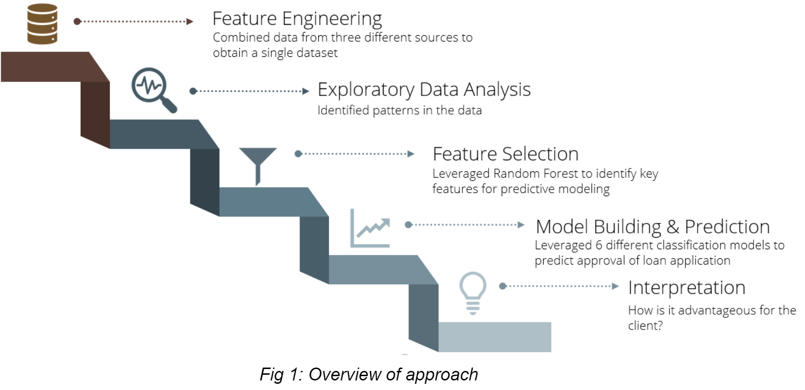

# Home-Credit-Default.Risk

## Project Overview

Home credit wants to predict how capable each applicant is of repaying the loan. They intend to broaden financial inclusion for the unbanked population with less credit histories by providing a safe borrowing experience. They wantto ensure that the clients capable of repaying the loan are not rejected.

This problem is more complex than your typical prediction problem. There are so many potential sources of data for each customer that can be considered. Once you consider all of them, you could be looking at more than 1,000 columns of data for each customer, equating to an enormous dataset and a prediction problem that’s well beyond that which we’re typically accustomed too. Thus, it becomes imperative that we run feature selection to make our task of predictive modeling manageable. The current baseline model implemented by Home Credit does not incorporate all the important features which could be used to predict if a customer will be able to repay the loan or not.

## Data

All the data files and The details about the dataset can be found on kaggle.

https://www.kaggle.com/c/home-credit-default-risk/overview

The process of data munging and transformation to obtain the final dataset 'merged_data.csv' can be seen in the jupyter notebook Predictive  Analytics Datasets with bureau.ipynb.  

## Approach Overview

## Solution Overview

After thoroughly testing the whole family of classifiers on the dataset and finding the one which offers the best performance for this task, we will be able to draw conclusions as to how our model will benefit both lenders and borrowers. All the models canbe seen in the notebooks inside the models folder.

The solution we recommend is Light Gradient Boosting Modeling which provides an Area Under the Curve (AUC) score of 0.77. Home Credit currently uses a simple logistic regression model for prediction. In our case, the Light GBM outperforms the logistic regression by a whopping 25%. This means that we are able to distinguish customers who are capable of repaying the loan from the ones who aren’t more precisely and less incorrectly by 25%. 
 - Additionally Light GBM models also have the following advantages:
 - They have higher efficiency accompanied by faster training speed
 - Better accuracy because it is an ensemble modeling method that tries to maximise accuracy by predicting the residuals
 - Supports large datasets 
 - Supports parallel processing & GPU learning

